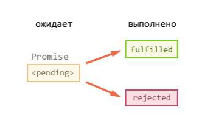

# Promise. Основы асинхронного программирования

1. Первое задание на демонстрацию работы асинхронного кода, и что будет
если неправильно писать код в этой парадигме.
Объявите переменную _i_ и проинициализируйте ее каким-нибудь числом.
Увеличьте значение переменной _i_ используя задержку setTimeout.
После setTimeout выведите значение переменной.
2. Переписать первое задание с использованием Promise.
3. Задание на промисификацию. Воспользуйтесь асинхронной функцией
чтения файла _readFile_, что находиться в модуле _fs_. Создайте свою функцию
обертку для функции _readFile_, которая будет возвращать объект промиса и
выполнять чтение файла внутри этого промиса, а результат чтения
помещать в _callback’и_ состояний. Используйте метод _then_ для того чтобы
вывести содержимое файла или вывести сообщение об ошибке.
4. Задание на написание HTTP сервера.
Воспользуйтесь своей функцией из прошлого задания для того чтобы
написать чтение HTML файлов для отправки клиентам. Расширьте
обработку ошибок, используя _chaining (цепочку)_ из методов _then_.

# Promise. Основы асинхронного программирования

Promise (промисы) – это очень удобный инструмент для организации
асинхронного кода.

По факту, промис – это объект, который содержит свое состояние. Это нужно для
того, чтобы понимать на каком этапе идет выполнение асинхронного скрипта:
_выполняется, выполнено успешно или выполнено с ошибкой._
Соответственно, у промиса есть три состояния для трех этих случаев: _ожидание,
выполнено, выполнено с ошибкой._



Когда скрипт выполняется, то промис будет просто ожидать его выполнения.
Успешное выполнение скрипта, называется _fulfilled_, а ошибкой – _rejected._
И чтобы обработать эти два состояния, вызываются функции _callback’и_ которые
соответствуют этим состояниям. 

**Пример создания:**

```javascript
const promise = new Promise((resolve, reject) => {
 // асинхронный код
}); 
```

resolve, reject – это callback’и.

Теперь нужно написать обработку состояний выполнения программы.

**Пример:**

```javascript
const promise = new Promise((resolve, reject) => {
 // асинхронный код
});

promise
 .then(
 result => console.log(result),
 error => console.log(error)
 ); 
```

Метод _then_ навешивает обработчики на эти состояния. В качестве аргументов,
этот метод принимает функции. Первая функция обрабатывает _fulfilled_, вторая –
_rejected._

К примеру, если код выполнился успешно, то: 

```javascript
const promise = new Promise((resolve, reject) => {
 resolve('Successful!');
});

promise
 .then(
 result => console.log(result),
 error => console.log(error)
 ); 
```

запустится первая функция что передается в метод _then_ и данные которые
передались в callback _resolve_, будут аргументом для первой функции в методе, и
сохраняться под именем _result._
Если же код выполниться с ошибкой, то:

```javascript
const promise = new Promise((resolve, reject) => {
 reject(new Error('Error 1'));
});

promise
 .then(
 result => console.log(result),
 error => console.log(error)
 );
```

запустится вторая функция по аналогии с первой, и ошибка «улетит» в аргумент
_error_ которую в данном примере мы выводим на экран. 
